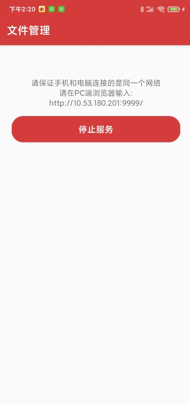
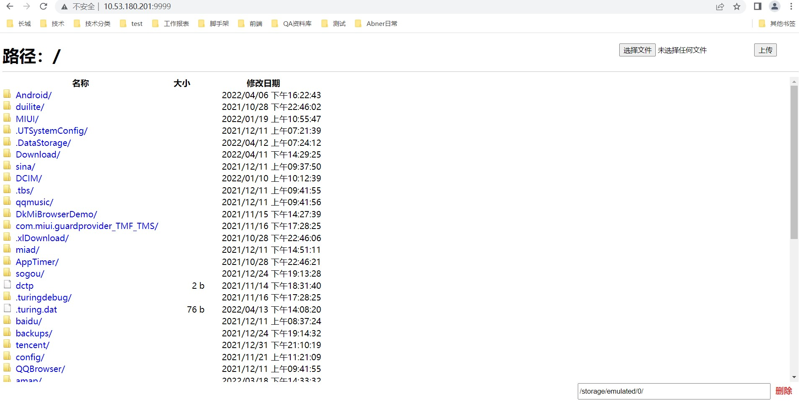

# SdManager

SdManager是一个可以在电脑端进行操作手机sd卡的一个可视化工具，通过手机和电脑连在同一个ip地址，便可轻松的进行文件的上传和下载，对于手机和电脑之间的传输，非常的方便，除了解决了因电脑权限无法直接访问手机sd卡的问题，大家也可以正常试用，绝对的好用。

## Demo效果预览

#### 第1步，apk下载，安装后，手机和电脑保持同一个wifi即可


#### 第2步，手机端开启服务，手机端效果



#### 第3步，电脑端就可以愉快的操作了，电脑端效果



#### 最后感谢yanzhenjie开源的AndServer，如果没有它，是完不成这个功能的

```
AndServer文档地址：https://yanzhenjie.com/AndServer/

```

## 欢迎关注作者

微信搜索【Android干货铺】，或扫描下面二维码关注，查阅更多技术文章！


## License

```
Copyright (C) AbnerMing, AndroidShortcutTools Open Source Project

Licensed under the Apache License, Version 2.0 (the "License");
you may not use this file except in compliance with the License.
You may obtain a copy of the License at

     http://www.apache.org/licenses/LICENSE-2.0

Unless required by applicable law or agreed to in writing, software
distributed under the License is distributed on an "AS IS" BASIS,
WITHOUT WARRANTIES OR CONDITIONS OF ANY KIND, either express or implied.
See the License for the specific language governing permissions and
limitations under the License.
```